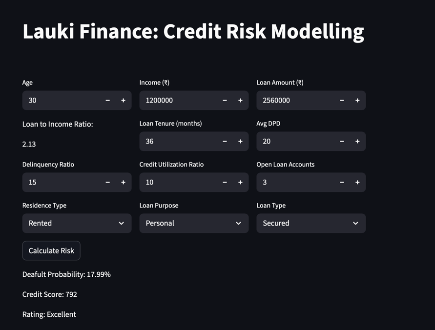

# 🧾 Credit Risk Scoring App – Lauki Finance

A machine learning application to assess the creditworthiness of borrowers for **Lauki Finance**, a non-banking financial company (NBFC) in India.

The model predicts the probability of loan default using applicant demographics, loan history, and credit bureau data. It also assigns a credit category: **Poor**, **Average**, **Good**, or **Excellent**.

Developed as part of a Phase 1 credit risk modeling project (2024), including data preparation, model development, explainability, and a Streamlit-based scoring app.

---

## 🎯 Project Objective

> **Goal:** Enable Lauki Finance’s Risk Unit to assess credit risk consistently and automatically.  
> **Success Criteria:**  
> - AUC > 85  
> - KS statistic > 40 (ideally concentrated in the first 3 deciles)  
> - High interpretability and decision transparency

---

## 🚀 Features

- ✅ Logistic Regression, XGBoost, and Random Forest models
- ✅ Scorecard classification into 4 credit classes
- ✅ Model tuning with RandomizedSearchCV and Optuna
- ✅ Integrated performance metrics: AUC, Gini, KS
- ✅ Streamlit-based UI for real-time prediction and scoring
- ✅ Modular and ready for MLOps extension (CI, deployment, monitoring)

---

## 📦 Installation & Usage

#### 1. Clone the repo

```bash
git clone https://github.com/JonnyNgaleu/credit-risk-score.git
cd credit-risk-score
```
#### 2. Create virtual env
```bash
python -m venv venv
source venv/bin/activate  # on Windows: venv\Scripts\activate
```
#### 3. Install dependencies
```bash
pip install -r requirements.txt
```
#### 4. Run the app
```bash
streamlit run app/main.py
```
---

## 🖼️ Live App Preview



---

## 🧠 Modeling Approach

**Target Variable:** `default` (binary)  
**Data Sources:** Loans issued between **Feb 2022 and May 2024**  
**Split:** 75% training – 25% testing  

**Features:**
- Customer data (age, income, employment)
- Loan details (type, amount, EMI, purpose)
- Bureau data (credit utilization, open accounts)

**Preprocessing Steps:**
- Invalid loan purposes cleaned using most frequent value (mode)
- Feature selection via IV (Information Value), VIF (Variance Inflation Factor), and domain knowledge
- Min-max scaling applied to numeric features

**Models Trained:**
- Logistic Regression
- Random Forest
- XGBoost

**Hyperparameter Tuning:**
- `RandomizedSearchCV` (for classical models)
- `Optuna` (for XGBoost optimization)

---

## 📊 Evaluation Metrics

| Metric              | Value (Best Model: XGBoost) |
|---------------------|-----------------------------|
| AUC                 | > 0.89                      |
| Gini Coefficient    | > 78%                       |
| KS Statistic        | > 45                        |
| Classification Score| Excellent                   |

> ✅ Risk stratification is concentrated in the first 3 deciles — ideal for financial decision-making.
